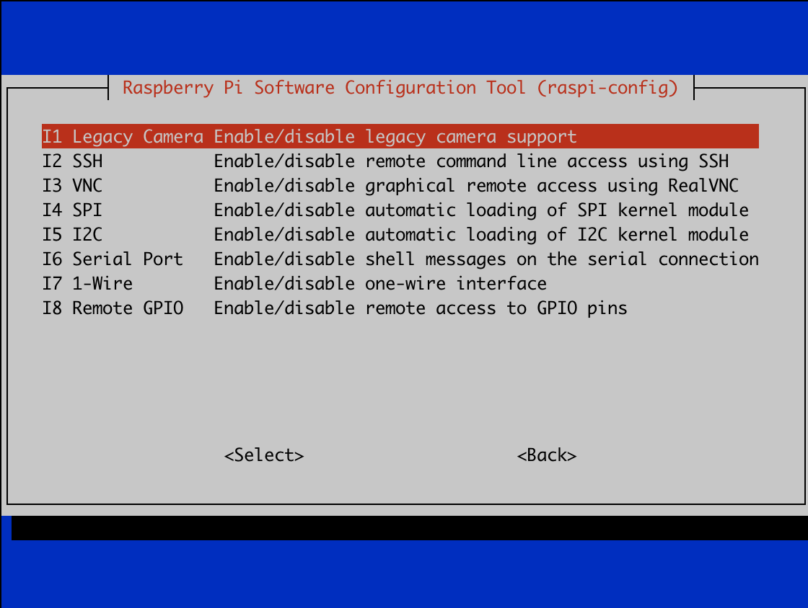

# Board SDK Install Guide

This documents provides guidelines to install board SDK required by this library.

- [Board SDK Install Guide](#board-sdk-install-guide)
	- [FILE](#file)
	- [QCS610](#qcs610)
	- [GSTREAMER](#gstreamer)
	- [V4L2](#v4l2)
	- [T31](#t31)
	- [FH8626V100](#fh8626v100)
	- [AK3918](#ak3918)
	- [C302](#c302)
	- [SV82x](#sv82x)

## FILE

FILE capturer is a dummy capturer that read sample frames from [resources/frames/]. It doesn't require user to manually install any 3rdparty SDK.

## QCS610

QCS610 receive and retrieve audio and video from the device through the Gstreamer pipeline. It doesn't require user to manually install any 3rdparty SDK.
Please configure the Qualcomm build environment first.
Replacing CMake configuration file.
```
export OE_CMAKE_TOOLCHAIN_FILE=3rdparty/QCS610/OEToolchainConfig.cmake
```

## Gstreamer

Gstreamer capturer receive and retrieve audio and video from the device through the Gstreamer pipeline. It require user to manually install Gstreamer library. You may install it via:
```
sudo apt install -y libgstreamer1.0-dev libgstreamer-plugins-base1.0-dev gstreamer1.0-plugins-base-apps gstreamer1.0-plugins-bad gstreamer1.0-plugins-good gstreamer1.0-plugins-ugly gstreamer1.0-tools
```
You should provide H264 video frames and g711a audio frames to the pipeline by Tcp. The pipeline used in the code is defined as the following macro.
```
GST_LAUNCH_VIDEO_PIPELINE_CMD
GST_LAUNCH_AUDIO_PIPELINE_CMD
GST_LAUNCH_AUDIO_PLAYER_PIPELINE_CMD
```
## V4L2

V4L2 request libv4l2 on your build device. You may install it via:

```
sudo apt install libv4l-dev
```

This library requires V4L2 cameras with H.264 encoder supports(i.e. Pi Camera). To check your camera capabilities, you may use `v4l2-ctl --list-formats` to check if it can be use. Take Pi camera as example:

```
v4l2-ctl --list-formats
ioctl: VIDIOC_ENUM_FMT
	Type: Video Capture

	[0]: 'YU12' (Planar YUV 4:2:0)
	[1]: 'YUYV' (YUYV 4:2:2)
	[2]: 'RGB3' (24-bit RGB 8-8-8)
	[3]: 'JPEG' (JFIF JPEG, compressed)
	[4]: 'H264' (H.264, compressed)
	[5]: 'MJPG' (Motion-JPEG, compressed)
	[6]: 'YVYU' (YVYU 4:2:2)
	[7]: 'VYUY' (VYUY 4:2:2)
	[8]: 'UYVY' (UYVY 4:2:2)
	[9]: 'NV12' (Y/CbCr 4:2:0)
	[10]: 'BGR3' (24-bit BGR 8-8-8)
	[11]: 'YV12' (Planar YVU 4:2:0)
	[12]: 'NV21' (Y/CrCb 4:2:0)
	[13]: 'RX24' (32-bit XBGR 8-8-8-8)
```

> For Raspberry Pi OS Bullseye or later, user must enable **Legacy Camera Support** to make the v4l2 device supports **H264**
> 

It doesn't require other manually installation because CMake will download and build dependencies automatically.

## T31

User need to put T31 board SDK under [3rdparty/T31/](T31/):

```
T31/
|-- include
|   |-- imp
|   `-- sysutils
|-- lib
|   |-- glibc
|   `-- uclibc
`-- samples
    |-- libimp-samples
    `-- libsysutils-samples
```

## FH8626V100

User need to put FH8626V100 board SDK under [3rdparty/FH8626V100/](FH8626V100/):

```
FH8626V100/
├── common
├── include
└── lib
```

## AK3918

User need to put AK3918 board SDK under [3rdparty/AK3918/](AK3918/):

```
AK3918/
├── framework
│   ├── include
│   └── lib
├── ipc_main.c
├── lib
│   ├── dynamic
│   └── static
└── platform
    ├── include
    ├── include_3rd
    ├── lib
    └── sample
```

## C302

User need to put C302 board SDK under [3rdparty/C302](C302/), including `sysroot` folder:

```
C302/
├── include
├── lib
└── sysroot
```

> Other related dependent libraries and header files need to obtain the cross-compiled toolchain of C302.

## SV82x

User need to put SV82x board SDK under [3rdparty/SV82x/](SV82x/):

```
SV82x/
├── common
├── include
├── lib
└── sample
```
